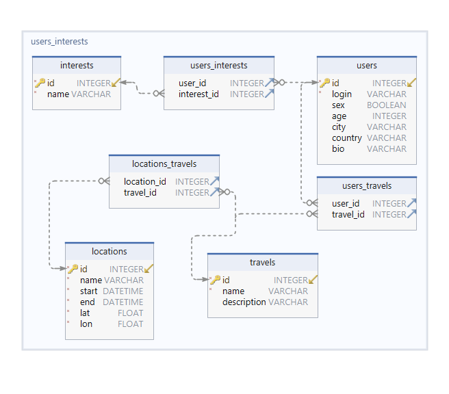

# Travel agent - Telegram бот для планирования путешествий

## Описание

Telegram-бот для планирования путешествий.

### [Ссылка на бота](https://t.me/travel_agent_tgbot) (Логин: travel_agent_tgbot)

## Демонстрация работы


## Инструкция по запуску

### Перед запуском Telegram-бота с помощью Docker вам необходимо установить следующее

1. Git: Система контроля версий для отслеживания изменений в исходном коде.
    - Ubuntu:

       ```bash
       sudo apt update
       sudo apt install git
       ```

    - Mac OS/Windows: Загрузите и установите Git с официального веб-сайта

2. Docker: Платформа для разработки, доставки и запуска приложений в контейнерах.
    - Ubuntu: Следуйте инструкциям в [официальной документации Docker по установке Ubuntu](https://docs.docker.com/engine/install/ubuntu/).
    - Mac OS/Windows: Загрузите и установите Docker Desktop с [официального веб-сайта Docker](https://www.docker.com/products/docker-desktop/).

### Клонируйте репозиторий

1. Откройте терминал или командную строку.
2. Клонируйте репозиторий бота с помощью Git:

    ```bash
    git clone https://github.com/Central-University-IT-prod/backend-Data-Name-ID.git travel_agent
    cd travel_agent
    ```

### Запуск

Создайте и запустите контейнер Docker:

```bash
docker compose up -d
```

### Проверьте контейнер бота

Чтобы убедиться, что контейнер бота запущен, используйте следующую команду:

```bash
docker compose ps
```

Вы должны будете увидеть похожую строку:

```bash
travel_agent    travel_agent-app ....
```

Если это так, бот запустился и работает.

## Выбранные технологии

1. Docker: Используется для упрощения управления и развертывания приложений в изолированных контейнерах.
2. PostgreSQL: Была выбрана в качестве базы данных для хранения данных бота из-за своей надежности и масштабируемости.
3. Python: Применяется в качестве основного языка программирования для разработки телеграм-ботов благодаря широкому спектру библиотек и фреймворков.
4. Redis: Используется для хранения state бота, даже после перезапуска.

### Модули Python

1. Aiogram: Этот фреймворк для создания телеграм-ботов был выбран из-за своей простоты и функциональности.
2. Environs: Используется для управления конфигурацией приложения, обеспечивая удобную работу с переменными окружения.
3. SQLAlchemy: Применяется для работы с базой данных, предоставляя удобный и мощный способ взаимодействия с ней.
4. Geopy: Используется для работы с геоданными и геолокацией, предоставляя удобные инструменты для работы с географическими данными.

## Внешние интеграции

1. Telegram: Используется для взаимодействия бота с пользователем.
2. OpenStreetMap: Используется для получения информации о локации, странах и местах.
3. GraphHopper: Используется для построения маршрутов на основе карт OpenStreetMap.

## ER-диаграмма проекта (Схема данных СУБД)



## Техническое задание

Ознакомиться с техническим заданием можно по ссылке: [Notion](https://centraluniversity.notion.site/Backend-Travel-agent-3-0-f2d4cbabbaa94a338d3ad6293a9f0b4f) | [Репозиторий](Technical%20Specification.md)
